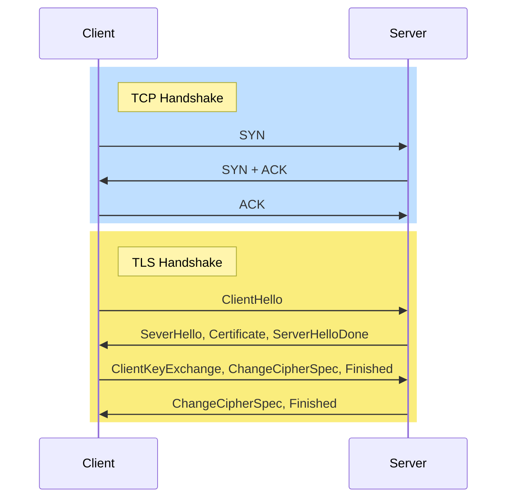

Netscape에서 개발한 SSL을 발전시킨 프로토콜로 인터넷 상의 통신을 위한 개인 정보와 데이터 보안을 용이하게 하기 위해 설계된 프로토콜
## 주요 요소
- 암호화
	→ 제 3자로부터 전송되는 데이터를 숨김
- 인증
	→ 정보를 교환하는 당사자가 요청된 당사자(서버)임을 보장
- 무결성
	→ 데이터가 위조되거나 변조되지 않았는지 확인

## 인증서 발급
TLS를  사용하기 위해서는 CA로부터 [[인증서]]를 발급받아야 한다.
### 발급 과정
1. 웹 사이트는 공개키-개인키 쌍을 생성한다.
2. 웹 사이트 정보와 공개키를 바탕으로 [[CSR]]을 작성하여 CA에게 전송한다.
3. CA는 공개키를 CA의 개인키로 암호화하여 [[디지털 서명]]을 생성한다.
4. 웹 사이트 정보와 디지털 서명을 포함하는 [[인증서]]를 웹 사이트에 발급한다.
## TLS 1.0 Handshake
[[TCP]] Handshake 이후 클라이언트의 세션키를 공유하는 TLS Handshake를 진행한다.

### 1. Client Hello - Client
TLS Handshake의 시작으로 클라이언트가 서버에게 보냄
다음과 같은 정보가 패킷에 포함된다.
- TLS version
	- 클라이언트가 사용하는 TLS version
- Cipher Suite List
	- Client가 지원하는 암호화 방식들
	- 대칭키, 비대칭키 암호화 알고리즘, 해시함수
- Client Random Data
	- 클라이언트에서 생성한 난수
	- 나중에 대칭키 생성에 사용됨
- Session ID
	- TLS Handshake를 매번 하지 않고 한 번 진행한 클라이언트를 구별하기 위해 사용
	- 최초 전송시 0으로 설정
	- 클라이언트가 보낸 Session ID가 0이라면 새로 Session ID를 발급하고 그렇지 않다면 해당 Session ID를 바탕으로 TLS 연결
	![[Pasted image 20240607075720.png]]
- [[SNI]]
### 2. Server Hello - Server
Client Hello에 대한 응답
다음과 같은 정보가 패킷에 포함된다.
- TLS version
	- 서버가 사용하는 TLS version
- Selected Suite
	- Cipher Suite List에서 서버가 선택한 암호화 방식
- Server Random Data
	- 서버에서 생성한 난수
	- 나중에 대칭키 생성에 사용됨
- Session ID
- [[SNI]]
	- 서버에서는 비워서 보냄
### 3. Server Certificate - Server
서버의 인증서를 클라이언트에서 전송하는 단계
클라이언트는 서버의 인증서를 검증
자세한 [[TLS 인증서 검증 과정]]
### 4. Server Hello Done - Server
서버의 Handshake가 완료됨
### 5. Client Key Exchange - Client
클라이언트 난수와 서버 난수를 조합하여 Pre-master secret 키 생성
Pre-master secret 키를 서버의 공개키로 암호화하여 서버에 전송
클라이언트와 서버는 Pre-master secret과 양측의 난수로 세션키 생성
### 6. Change Cipher Spec - Client
클라이언트가 이후 메시지가 암호화됨을 알림
### 7. Finished - Client
클라이언트 Handshake 종료
### 8. Change Cipher Spec - Server
클라이언트가 이후 메시지가 암호화됨을 알림
### 9. Finished - Server
서버 Handshake 종료

## 참고
https://babbab2.tistory.com/7
https://cuziam.tistory.com/entry/TLSHTTPS%EC%9D%98-%EB%8F%99%EC%9E%91-%EC%9B%90%EB%A6%AC%EC%99%80-%EA%B3%BC%EC%A0%95
https://www.cloudflare.com/ko-kr/learning/ssl/what-happens-in-a-tls-handshake/

#network #security