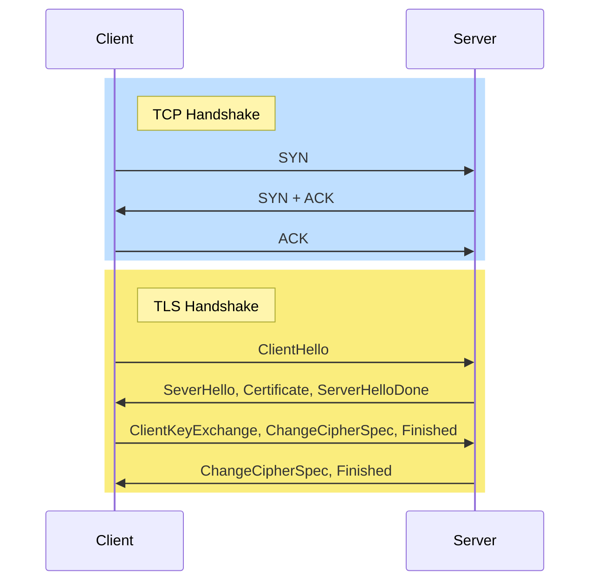

Netscape에서 개발한 SSL을 발전시킨 프로토콜로 인터넷 상의 통신을 위한 개인 정보와 데이터 보안을 용이하게 하기 위해 설계된 프로토콜
## 주요 요소
- 암호화
	→ 제 3자로부터 전송되는 데이터를 숨김
- 인증
	→ 정보를 교환하는 당사자가 요청된 당사자(서버)임을 보장
- 무결성
	→ 데이터가 위조되거나 변조되지 않았는지 확인

## 인증서 발급
TLS를  사용하기 위해서는 CA로부터 [[인증서]]를 발급받아야 한다.
### 발급 과정
1. 웹 사이트는 공개키-개인키 쌍을 생성한다.
2. 웹 사이트 정보와 공개키를 바탕으로 [[CSR]]을 작성하여 CA에게 전송한다.
3. CA는 공개키를 CA의 개인키로 암호화하여 [[디지털 서명]]을 생성한다.
4. 웹 사이트 정보와 디지털 서명을 포함하는 [[인증서]]를 웹 사이트에 발급한다.
## TLS Handshake
[[TCP]] Handshake 이후 클라이언트의 세션키를 공유하는 TLS Handshake를 진행한다.

1. ClientHello
2. ServerHello
3. Certifiacate
4. ServerHelloDone
5. ClientKeyExchange
6. ChangeCipherSpec
7. Finished
8. ChangeCipherSpec
9. Finished

#network #security